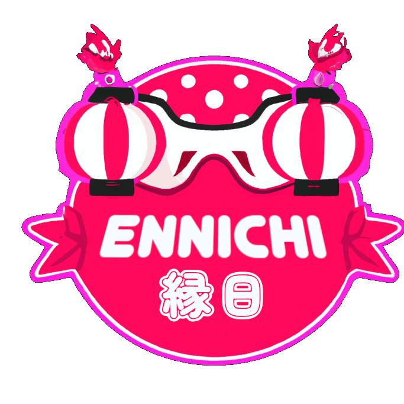

# Ennichi

    

## About

**Ennichi** is a virtual reality game inspired by the Japanese festival tradition of the same name. 

The game consists of a series of minigames that the player can play in order to earn points. 

The player can then use these points to buy items from the shops in the stalls.

This project was developed for the Virtual Reality course of the Master in Informatics and Computing Engineering at FEUP.

The game was developed using Unity and the Meta Quest 2.

Click [here](demo.mp4) to see a demo.

## Group

- David Preda (up201904726@edu.fe.up.pt)
- Eduardo Correia (up201806433@edu.fe.up.pt)
- Mário Travassos (up201905871@edu.fe.up.pt)

## Features

- Minigames
  - Darts
  - Knock-the-Cans 
- Pick up and throw items
  - Darts
  - Balls
  - Bought items
- Movement
  - Teleportation
  - Continuous movement
- In-world UI
  - Number of coins information
  - Game information
  - Stall interaction

## Used Assets

- Festival scene
- Can
- Dart
- Target
- Hands
- Skyboxes
- Ground textures